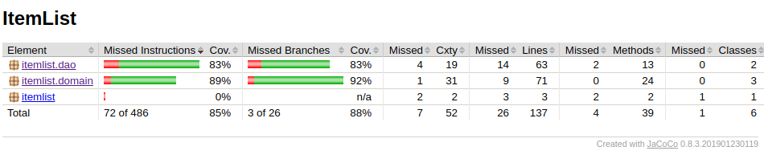

# Testausdokumentti

Ohjelmaa on testattu yksikkötesteillä ja integraatiotesteillä Junitilla. Testausta on tapahtunut myös manuaalisesti käyttämällä ohjelmaa.

## Yksikkö- ja integraatiotestaus

### Sovelluslogiikka

Automatisoidut testit ovat tehty sovelluslogiikalle, jotka ovat pakkauksessa itemlist.domain. User ja Item luokille on toteutettu yksikkötestejä. Integraatiotestejä on toteutettu ItemListUserTest sekä ItemListItemTest, joiden on tarkoitus simuloida toiminnallisuuksia, jotka löytyvät ItemLististä.

Integraatiotesteissä on hyödynnetty FakeItemDao ja FakeUserDao toteutuksia, jotka vastaavat testeissä pysyväistallennuksesta.

### DAO- luokat

DAO-luokat UserDao ja ItemDao ovat molemmat testattu Junitin avulla.

### Domain 

Domain:ssa sijaitsevat luokat Item, User ja ItemList. Näistä eniten testattiin 

### Testauskattavuus

## Järjestelmätestaus

Ohjelman toimintaa on testattu [käyttöohjeen](https://github.com/repemi/ot-harjoitustyo/blob/master/dokumentaatio/kayttoohje.md) mukaan manuaalisesti.

## Puutteet

Testauskattavuutta pystyy vielä nostamaan, mm. Try – catch on muutamassa kohtaa jäänyt testaamatta. 
