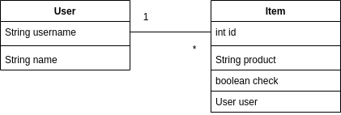

# Arkkitehtuurikuvaus

## Rakenne

Ohjelmassa noudatetaan kolmitasoista kerrosarkkitehtuuria, ja pakkausrakenne koodille on seuraavanlainen:


Pakkaus _itemlist.ui_ sisältää JavaFX:llä toteutettuun käyttöliittymään kuuluvat asiat kuten näkymät ja käytettävät komponentit.
_itemlist.domain_ huolehtii sovelluksen logiikasta mm. sovelluksen tilasta ja toiminnoista.
_itemlist.dao_  kansion alta löytyy tietojen pysyväistallennuksesta vastaava koodi. 

## Käyttöliittymä

Käyttöliittymässä on kolme erillistä näkymää: 

* Kirjautumisnäkymä _(loginScene)_
* Pakkauslista/Päänäkymä _(itemListScene)_
* Uuden käyttäjän luonti _(newUserScene)_

Jokainen näkymä näkyy vain yksi kerrallaan käyttäjälle ja ne ovat toteutettun JavaFX:n Scene-olioina. Käyttöliittymä on rakennettu luokassa [itemlist.ui.App](https://github.com/repemi/ot-harjoitustyo/blob/master/ItemList/src/main/java/itemlist/ui/App.java)


## Sovelluslogiikka

Sovelluksen loogisesta tietomallista vastaavat luokat [Item](https://github.com/repemi/ot-harjoitustyo/blob/master/ItemList/src/main/java/itemlist/domain/Item.java) ja [User](https://github.com/repemi/ot-harjoitustyo/blob/master/ItemList/src/main/java/itemlist/domain/User.java) Luokat kuvaavat menoja, käyttäjiä ja niiden tehtäviä.




[ItemList](https://github.com/repemi/ot-harjoitustyo/blob/master/ItemList/src/main/java/itemlist/domain/ItemList.java) on toiminnallisuudesta vastaava luokka. Luokan avulla tarjotaan käyttöliittymälle jokaiselle toiminnolle oma metodi, joita ovat mm.

- boolean login(String username)
- void createItem(String product, User user)


## Tietojen pysyväistallennus

Pakkauksen _itemlist.dao_ luokat _FileItemDao_  ja _FileUserDao_ huolehtivat tietojen tallettamisesta tiedostoihin.

Luokissa noudatetaan Data Access Object- suunnittelumallia. Luokat ovat rajapintojen _ItemDao_ ja _UserDao_ takana.

### Tiedostot

Sovelluksessa tietojen tallentaminen tapahtuu kahteen erilliseen tiedostoon. Sovelluksen juuresta löytyy [config.properties](https://github.com/repemi/ot-harjoitustyo/blob/master/ItemList/config.properties), jossa määritellään tiedostojen nimet.

Käyttäjät talletetaan tiedostoon → ensin käyttäjätunnus, jonka jälkeen puolipisteellä erotellaan käyttäjän nimi. 

```
mminna; Minna Mallikas
sepi; Seppo Seuraava

``` 

Käyttäjien pakkauslistoille kirjatut tavarat talletetaan tiedostoon → Tuotteen tunniste _id, seuraavaksi mikä tuote halutaan pakata, kolmanneksi tieto siitä onko tuote jo pakattu ja viimeisenä löytyy kenen käyttäjän tuotteesta on kyse. Kuten käyttäjät, myös tuotteiden tiedot erotellaan puolipisteillä

```
1;housut;false;mminna
2;hammasharja;true;mminna
3;puhelimen laturi;false;sepi
``` 

## Ohjelman rakenteeseen jääneet heikkoudet

Niitä on paljon. Sovellus on äärimmäisen yksinkertainen. Siitä löytyy toisteista koodia käyttöliittymästä mm. taustakuvan olisi voinut miettiä omaksi luokakseen tai ainakin omaksi metodikseen. Dao luokissa toistesta koodia. Myös sovelluksen käynnistys on hyvin hidas, joten taustakuvien lataamista kannattaisi miettiä fiksummin ja tehokkaammin. Tästä nyt muutamia huomioita monista.

