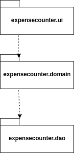
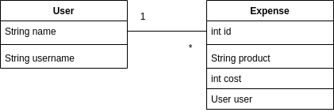

# Arkkitehtuurikuvaus

## Rakenne

Ohjelmassa noudatetaan kolmitasoista kerrosarkkitehtuuria, ja pakkausrakenne koodille on seuraavanlainen:

Pakkaus _expenses.ui_ sisältää JavaFX:llä toteutettuun käyttöliittymään kuuluvat asiat kuten näkymät ja käytettävät komponentit.
_expenses.domain_ huolehtii sovelluksen logiikasta mm. sovelluksen tilasta ja toiminnoista.
_expenses.dao_  kansion alta löytyy tietojen pysyväistallennuksesta vastaava koodi. 

## Käyttöliittymä

Käyttöliittymässä on kolme erillistä näkymää: 

* Kirjautumisnäkymä _(loginScene)_
* Menolaskuri/Päänäkymä _(expensesScene)_
* Uuden käyttäjän luonti _(newUserScene)_

Jokainen näkymä näkyy vain yksi kerrallaan käyttäjälle ja ne ovat toteutettun JavaFX:n Scene-olioina. Käyttöliittymä on rakennettu luokassa [expense.ui.App](https://github.com/repemi/ot-harjoitustyo/blob/master/ExpenseCounter/src/main/java/expensecounter/ui/App.java)

## Sovelluslogiikka

Sovelluksen loogisesta tietomallista vastaavat luokat [Expense](https://github.com/repemi/ot-harjoitustyo/blob/master/ExpenseCounter/src/main/java/expensecounter/domain/Expense.java) ja [User](https://github.com/repemi/ot-harjoitustyo/blob/master/ExpenseCounter/src/main/java/expensecounter/domain/User.java). Luokat kuvaavat menoja, käyttäjiä ja niiden tehtäviä.

[ExpensesCounter](https://github.com/repemi/ot-harjoitustyo/blob/master/ExpenseCounter/src/main/java/expensecounter/domain/ExpenseCounterService.java) on toiminnallisuudesta vastaava luokka. Luokan avulla tarjotaan käyttöliittymälle jokaiselle toiminnolle oma metodi, joita ovat:

- boolean login(String username)
-void createExpense(String product, User user)
- lisää metodeja..
-

## Tietojen pysyväistallennus

Pakkauksen _expenses.dao_ luokat _FileExpenseDao_  ja _FileUserDao_ huolehtivat tietojen tallettamisesta tiedostoihin.
