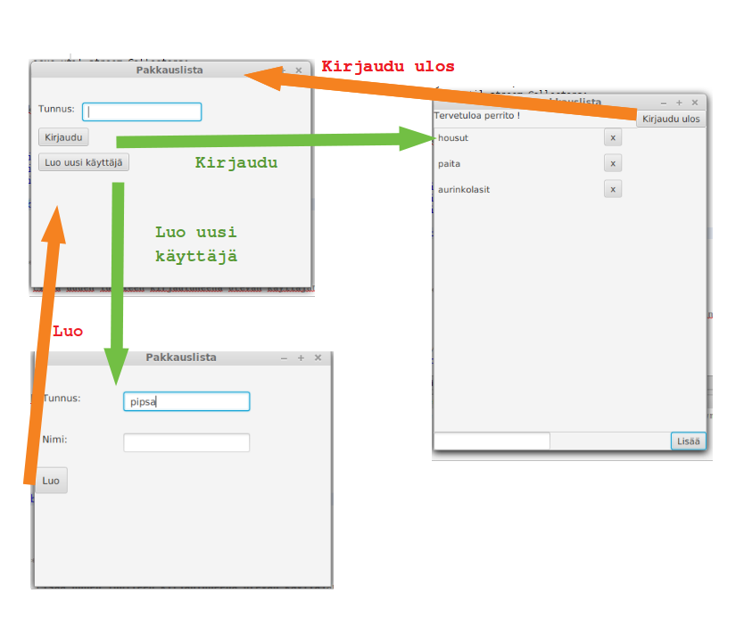

# Vaatimusmäärittely

## Sovelluksen tarkoitus

Sovellus on yksinkertainen pakkauslista, jonka avulla voi suunnitella, mitä tavaroita pitää pakata mukaan reissuun. Sovellusta käytetään kirjautuneena, jolloin se myös muistaa mitä sinne on aiemmin kirjoittanut muistiin. Sovellukseen voi useampi kirjautunut käyttäjä luoda itsellensä pakkauslistan.

## Käyttäjät

Käyttäjärooleja on peruskäyttäjä. Myöhemmin ajan puitteissa lisätään ylläpitäjä, jolla on enemmän oikeuksia esim. Peruskäyttäjien hallinnointi ( = käyttäjien poistaminen).

## Käyttöliittymä luonnos

Sovellus koostuu kolmesta (3) näkymästä:

1. Kirjautumisnäkymä : voi kirjautua sisään sovellukseen tai luoda uuden käyttäjätunnuksen
2. Uuden käyttäjätunnuksen luonti: luodaan uusi käyttäjätunnus, josta palataan takaisin kirjautumisnäkymään, kun tunnus on luotu onnistuneesti.
3. Pakkauslista näkymä : kirjautunut käyttäjä pääsee katselemaan omaa listaansa, ja poistamaan tuotteita/tavaroita, jotka on saanut pakattua.

## Toiminnallisuudet

### Sovelluksen käynnistyminen

_Uuden tunnuksen luominen_
- Käyttäjän on mahdollista luoda uusi käyttäjätunnus järjestelmään.
- Käyttäjätunnus on yksilöllinen, ja siitä tulee virheilmoitus, jos yrittää luoda, jo käytössä olevan tunnuksen.

_Kirjautuminen_
- Käyttäjä voi kirjautua järjestelmään, tunnuksella, joka on jo olemassa.
- Jos yrittää kirjautua järjestelmään, ennen kuin tunnus on luotu tai sitä ei ole olemassa, siitä tulee virheilmoitus

### Kirjautumisen jälkeen

- Kirjautunut käyttäjä näkee oman pakkauslistansa, eli vielä pakkaamattomat tarvarat.
- Käyttäjä voi halutessaan kuitata tuotteen/tavaran pakatuksi, jolloin se häviä listalta.
- Käyttäjän tulee kirjautua ulos järjestelmästä, jos haluaa sulkea sovelluksen.

## Jatkokehitysideoita

Ensimmäisen version jälkeen, sovellukseen voidaan lisätä seuraavia toiminnallisuuksia.

- Pakatut tarvarat säilyvät listalla (esim. Ne voidaan yliviivata)
-  Jos reissuun lähtiessä tarvitsee vaikka useammat housut, niin voisi lisätä tuotteiden lukumäärän tuotteen perään.
- Pakkauslista olisi mahdollista jakaa muiden käyttäjien kanssa, esim. Perheen lomareissua varten suunniteltua pakkauslistaa pääsisivät useammat käyttäjät tutkimaan.
- Pakkauslistalle voisi luoda yläkategorioita, jonka alle tuotteet sijoitettaisiin. Esim. Vaatteet, hygienia jne.
- Salasana käyttäjätunnuksen yhteyteen.
